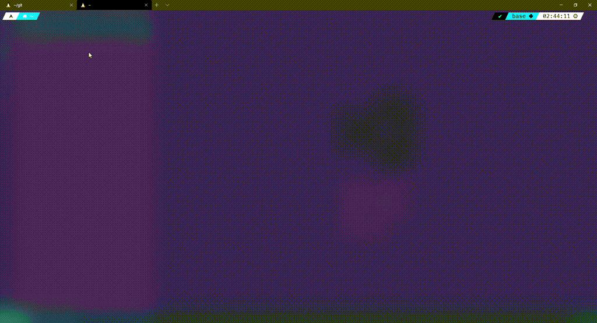

<h1 align="center">청와대 국민청원 수집기 👋</h1>
<p>
  
  <a href="https://github.com/100milliongold/petitions_scraper_npm#readme" target="_blank">
    
  </a>
  <a href="https://github.com/100milliongold/petitions_scraper_npm/graphs/commit-activity" target="_blank">
    
  </a>
  <a href="https://github.com/100milliongold/petitions_scraper_npm/blob/master/LICENSE" target="_blank">
    
  </a>
  <a href="https://travis-ci.com/100milliongold/petitions_scraper_npm" target="_blank">
    
  </a>
  <a href='https://coveralls.io/github/100milliongold/petitions_scraper_npm?branch=main'></a>

</p>



> 청와대 국민청원 게시판의 데이터를 수집하는 스크래퍼 입니다. (https://github.com/lovit/petitions_scraper 참고)

### 🏠 [Homepage](https://github.com/100milliongold/petitions_scraper_npm#readme)

## 설치

글로벌로 설치 해서 사용하거나

```sh
npm install -g petitions_scraper_npm
node_petitions_scraper -s <START> -e <END> -o <SAVEFILE>
```

또는

```sh
npm install --save petitions_scraper_npm

# index.js
import petitions from 'petitions_scraper_npm'

petitions.scraper_list(<START> , <END>).then(res => console.log(res))

petitions.scraper(index).then(res => console.log(res))

```

개발간에 사용 하시면 됩니다.

## 빌드

```sh
npm run build
```

## 테스트

```sh
npm run test
```

## 기여자

👤 **100milliongold <gadian88@gmail.com>**

- Github: [@100milliongold](https://github.com/100milliongold)

## 🤝 Contributing

사용간에 문의사항은 [issues page](https://github.com/100milliongold/petitions_scraper_npm/issues) 으로 해주시기 바랍니다.

## 📝 License

Copyright © 2020 [100milliongold <gadian88@gmail.com>](https://github.com/100milliongold).<br />
This project is [MIT](https://github.com/100milliongold/petitions_scraper_npm/blob/master/LICENSE) licensed.

---

_This README was generated with ❤️ by [readme-md-generator](https://github.com/kefranabg/readme-md-generator)_
